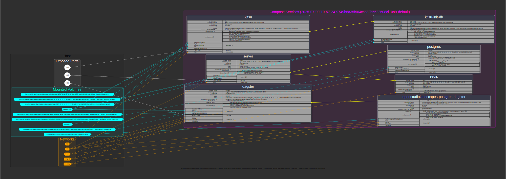
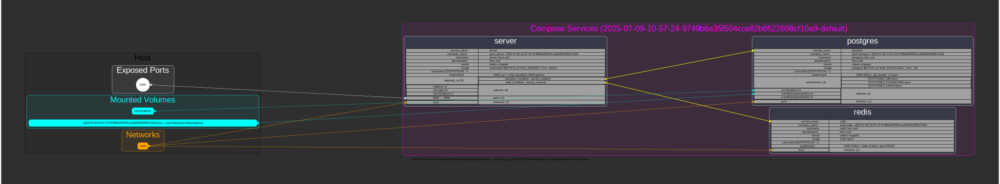
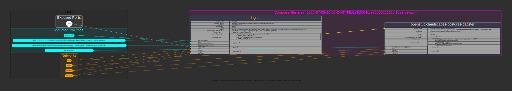
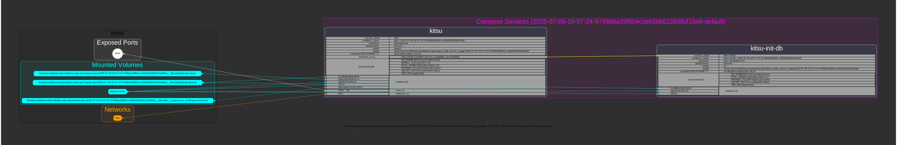

[](https://github.com/michimussato/OpenStudioLandscapes)

---

<!-- TOC -->
* [OpenStudioLandscapes-Demo-Landscape](#openstudiolandscapes-demo-landscape)
  * [Brief](#brief)
  * [Clone](#clone)
* [Run Landscape](#run-landscape)
  * [Full Landscape](#full-landscape)
    * [Full Reset](#full-reset)
  * [Individual Features](#individual-features)
    * [Ayon](#ayon)
    * [Dagster](#dagster)
    * [Kitsu](#kitsu)
* [Docker](#docker)
  * [Tag](#tag)
  * [Push](#push)
  * [Pull](#pull)
<!-- TOC -->

---

# OpenStudioLandscapes-Demo-Landscape

## Brief

This is a pre-made (and slightly adjusted) Demo Landscape. You can use 
[OpenStudioLandscapes](https://github.com/michimussato/OpenStudioLandscapes)
to create Landscapes similar to this one. 

This Demo Landscape lets you bypass the OpenStudioLandscapes set up procedure and
gives you a quick way to examine a Landscape and experiment with it. 
This Landscape comes with these
Features:
- [OpenStudioLandscapes-Ayon](https://github.com/michimussato/OpenStudioLandscapes-Ayon)
- [OpenStudioLandscapes-Dagster](https://github.com/michimussato/OpenStudioLandscapes-Dagster)
- [OpenStudioLandscapes-Kitsu](https://github.com/michimussato/OpenStudioLandscapes-Kitsu)

## Clone

```shell
git clone --recursive https://github.com/michimussato/OpenStudioLandscapes-Demo-Landscape.git
cd OpenStudioLandscapes-Demo-Landscape
```

> [!IMPORTANT]
> All the following commands assume that you are (`cwd`) in the `OpenStudioLandscapes-Demo-Landscape` directory.

# Run Landscape

## Full Landscape



`cmd_docker_compose_up`

```shell
./2025-07-09-10-57-24-9749b6a35f504cce82b6622608cf10a9/ComposeScope_default__ComposeScope_default/ComposeScope_default__DOCKER_COMPOSE/docker_compose/docker_compose_up.sh
```

`cmd_docker_compose_down`

```shell
./2025-07-09-10-57-24-9749b6a35f504cce82b6622608cf10a9/ComposeScope_default__ComposeScope_default/ComposeScope_default__DOCKER_COMPOSE/docker_compose/docker_compose_down.sh
```

### Full Reset

> [!WARNING]
> All untracked/changed data in `cwd` will be erased and reset


```shell
sudo git clean --force -x .
```

## Individual Features

### Ayon



`cmd_docker_compose_up`

```shell
./2025-07-09-10-57-24-9749b6a35f504cce82b6622608cf10a9/Ayon__Ayon/Ayon__DOCKER_COMPOSE/docker_compose/docker_compose_up.sh
```

`cmd_docker_compose_down`

```shell
./2025-07-09-10-57-24-9749b6a35f504cce82b6622608cf10a9/Ayon__Ayon/Ayon__DOCKER_COMPOSE/docker_compose/docker_compose_down.sh
```

### Dagster



`cmd_docker_compose_up`

```shell
./2025-07-09-10-57-24-9749b6a35f504cce82b6622608cf10a9/Dagster__Dagster/Dagster__DOCKER_COMPOSE/docker_compose/docker_compose_up.sh
```

`cmd_docker_compose_down`

```shell
./2025-07-09-10-57-24-9749b6a35f504cce82b6622608cf10a9/Dagster__Dagster/Dagster__DOCKER_COMPOSE/docker_compose/docker_compose_down.sh
```

### Kitsu



`cmd_docker_compose_up`

```shell
./2025-07-09-10-57-24-9749b6a35f504cce82b6622608cf10a9/Kitsu__Kitsu/Kitsu__DOCKER_COMPOSE/docker_compose/docker_compose_up.sh
```

`cmd_docker_compose_down`

```shell
./2025-07-09-10-57-24-9749b6a35f504cce82b6622608cf10a9/Kitsu__Kitsu/Kitsu__DOCKER_COMPOSE/docker_compose/docker_compose_down.sh
```

# Docker

## Tag

Images created by OpenStudioLandscapes were (afterwards) tagged with:

```shell
docker tag openstudiolandscapes/openstudiolandscapes_base_build_docker_image:2025-07-09-10-57-24-9749b6a35f504cce82b6622608cf10a9 docker.io/michimussato/openstudiolandscapes_base_build_docker_image:2025-07-09-10-57-24-9749b6a35f504cce82b6622608cf10a9
docker tag openstudiolandscapes/openstudiolandscapes_dagster_build_docker_image:2025-07-09-10-57-24-9749b6a35f504cce82b6622608cf10a9 docker.io/michimussato/openstudiolandscapes_dagster_build_docker_image:2025-07-09-10-57-24-9749b6a35f504cce82b6622608cf10a9
docker tag openstudiolandscapes/openstudiolandscapes_kitsu_build_docker_image:2025-07-09-10-57-24-9749b6a35f504cce82b6622608cf10a9 docker.io/michimussato/openstudiolandscapes_kitsu_build_docker_image:2025-07-09-10-57-24-9749b6a35f504cce82b6622608cf10a9
```

## Push

And then pushed with:

```shell
docker push michimussato/openstudiolandscapes_base_build_docker_image:2025-07-09-10-57-24-9749b6a35f504cce82b6622608cf10a9
docker push michimussato/openstudiolandscapes_dagster_build_docker_image:2025-07-09-10-57-24-9749b6a35f504cce82b6622608cf10a9
docker push michimussato/openstudiolandscapes_kitsu_build_docker_image:2025-07-09-10-57-24-9749b6a35f504cce82b6622608cf10a9
```

## Pull

```shell
docker pull michimussato/openstudiolandscapes_base_build_docker_image:2025-07-09-10-57-24-9749b6a35f504cce82b6622608cf10a9
docker pull michimussato/openstudiolandscapes_dagster_build_docker_image:2025-07-09-10-57-24-9749b6a35f504cce82b6622608cf10a9
docker pull michimussato/openstudiolandscapes_kitsu_build_docker_image:2025-07-09-10-57-24-9749b6a35f504cce82b6622608cf10a9
```
